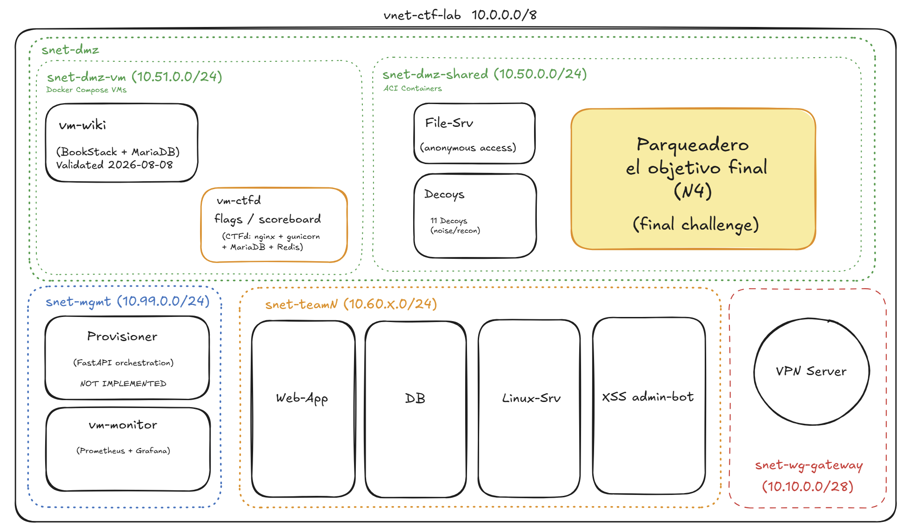

# Sabana Corp: Isolated Azure CTF/Cyber-Range Infrastructure

Spin up a complete, isolated CTF/cyber-range lab in Azure with a handful of bash commands. Fully automated deployment of isolated network, competition infrastructure, VPN gateway, DNS, monitoring, and CTF platform — used in production for **Sabana Corp**, the Capture The Flag competition at Universidad de la Sabana's Semana de Ingeniería.

All services run in **Azure Container Instances** (ACI) or VMs within a private VNet with no internet egress. Access only via WireGuard VPN behind a captive portal, per-team isolated tunnels with custom firewall rules, internal DNS for reconnaissance, and real-time observability dashboard for event staff.

## Quick Start

```bash
# 1. Prerequisites
export DOCKERHUB_USER="your_username"
export DOCKERHUB_TOKEN="your_token"
cp yamls/.env.secrets.example yamls/.env.secrets
# Edit yamls/.env.secrets with your flags/secrets

# 2. Spin up infrastructure (base network, DMZ, wiki, CTFd, VPN gateway, monitoring)
./lab-azure.sh up
./lab-azure.sh deploy-dmz
./lab-azure.sh deploy-wiki-vm
./lab-azure.sh deploy-ctfd-vm
./lab-azure.sh deploy-wg-gateway
./lab-azure.sh deploy-monitor-vm

# 3. Add teams (parallelized for speed)
./lab-azure.sh add-team-range 1 20 4    # 20 teams, 4 in parallel

# 4. Check status and access
./lab-azure.sh status
# Use yamls/generated/wg-clients/admin.conf for VPN access

# Clean up when done
./lab-azure.sh down
```

For detailed commands and architecture, see the rest of this README and CLAUDE.md.

## Architecture



### Design-to-Implementation Evolution

The original architecture (sketched above) envisioned WikiInt and CTFd as shared ACI containers in `snet-dmz-shared`. During implementation, both services moved to a dedicated Docker Compose VM subnet (`snet-dmz-vm`) due to platform limitations: BookStack requires real PID 1 (ACI on VNet doesn't support s6-overlay), and CTFd's full compose stack is simpler to maintain on a VM than split across ACI containers. Provisioner remains unimplemented—no image exists yet; it's the only planned component still in design phase. These decisions represent practical engineering iteration: design informed the initial structure, but real-world platform constraints drove solutions optimized for operational simplicity and validated end-to-end against live Azure infrastructure.

## Implementation Status

**Production-ready, fully validated (August 2026):**
- Base infrastructure: Resource Group, VNet (`10.0.0.0/8`), 6 subnets (delegated/non-delegated as needed)
- 13 shared DMZ containers in ACI: filesrv, parking, 11 decoys — accessible to all teams
- Wiki + wiki-db on VM (`vm-wiki`, snet-dmz-vm, docker-compose) — validated end-to-end 2026-08-08
- Per-team containers: database, webapp, linux-server, xss-bot (4 containers × N teams)
- Each container receives its own private IP within its subnet
- Secrets and flags injected via environment variables (same set for all teams, as CTFd requires)
- Automatic IP resolution between dependent containers
- **WireGuard Gateway** (`vm-wg-gateway`, snet-wg-gateway, public IP, UDP 51820) with per-peer access isolation via `iptables` — validated end-to-end 2026-08-08
- **Internal DNS** (dnsmasq on `vm-wg-gateway`, domain `sabanacorp.internal`): names for teams/DMZ resolvable from ACI containers and from participant PCs via VPN tunnel — validated end-to-end 2026-08-10. See `docs/plans/internal-dns.md`
- **CTFd** (flags and scoreboard on `vm-ctfd`, snet-dmz-vm, docker-compose: nginx + gunicorn + MariaDB + Redis) — validated end-to-end 2026-08-11. Challenges load as `hidden` by default; publish with `CTFD_SEED_PUBLISH=1` or `seed_challenges.py --publish`. See `docs/plans/ctfd-deployment.md`
- **Observability** (Prometheus + Grafana on `vm-monitor`, snet-mgmt, live discovery via `az container list`, 2 dashboards, 7 alert rules) — validated end-to-end 2026-08-10. See `docs/plans/observability-monitoring.md`

**Not implemented:**
- **Provisioner** (automatic team resource provisioning): no image/Dockerfile exists yet; documented in architecture only
- **NSG segmentation**: design completed in `docs/plans/network-segmentation-nsgs.md`, not applied (today all subnets see each other without restriction within the VNet)
- **Persistent wiki storage on VM**: docker-compose volumes (`wiki_mariadb_data`, `wiki_bookstack_config`) use local disks. Destroying the VM loses data — for a persistent lab, implement Azure File Share

Base infrastructure was deployed for testing 2026-08-01/02, validated successfully, then destroyed. **On 2026-08-08, end-to-end testing of complete infrastructure + teams** (`up`, `deploy-dmz`, `deploy-wiki-vm`, `deploy-wg-gateway`, `add-team`/`add-team-range`, and VPN flow) was completed. **On 2026-08-10, internal DNS and observability were validated** (`deploy-monitor-vm`). **On 2026-08-11, CTFd was validated** (`deploy-ctfd-vm`). The only untested components are those that don't exist yet: Provisioner and plans in `docs/plans/` marked as design phase.

## Prerequisites

```bash
# Installed and functional:
az CLI                                    # Azure CLI (az login against Azure Pay-As-You-Go)
envsubst                                  # Package gettext-base
docker login                              # Docker Hub credentials configured

# Export environment variables:
export DOCKERHUB_USER="your_username"
export DOCKERHUB_TOKEN="access_token"     # Docker Hub → Account Settings → Security → New Access Token

# Files:
cp yamls/.env.secrets.example yamls/.env.secrets
# Edit yamls/.env.secrets with real flags/secrets
```

**Subscription note**: Requires **Azure Pay-As-You-Go** (not student grants/free tiers). VMs (`vm-wiki`, `vm-wg-gateway`, `vm-ctfd`, `vm-monitor`) require modern VM quota, available only on pay-as-you-go subscriptions. For a subscription in a region other than `eastus2`, edit `RG`, `LOCATION`, and `VNET` in `lab-azure.sh`.

## Usage Flow

**Base infrastructure (required):**
```bash
./lab-azure.sh up                    # Create RG, VNet, 6 base subnets, delegate snet-dmz-shared to ACI
```

**Shared DMZ:**
```bash
./lab-azure.sh deploy-dmz            # Deploy 13 containers to snet-dmz-shared (filesrv, parking, decoys)
./lab-azure.sh deploy-wiki-vm        # Deploy vm-wiki to snet-dmz-vm with wiki+wiki-db via docker-compose
./lab-azure.sh deploy-ctfd-vm        # Deploy vm-ctfd to snet-dmz-vm with CTFd (nginx+gunicorn+MariaDB+Redis)
                                     # Loads /setup and challenges with no manual clicks, but they remain
                                     # 'hidden' by default -- export CTFD_SEED_PUBLISH=1 before the
                                     # command to publish them at once (or run seed_challenges.py
                                     # --publish against already-deployed vm-ctfd, no recreation needed)
                                     # Validated end-to-end 2026-08-11 (see docs/plans/ctfd-deployment.md,
                                     # "Event Day Runbook" for exact commands)
```

**VPN Gateway (optional but required for remote access):**
```bash
./lab-azure.sh deploy-wg-gateway     # Create vm-wg-gateway (public IP, WireGuard UDP 51820)
                                     # + generate admin client at yamls/generated/wg-clients/admin.conf
                                     # Validated end-to-end 2026-08-08 (see docs/plans/wireguard-vpn-gateway.md)
```

**Observability (optional):**
```bash
./lab-azure.sh deploy-monitor-vm     # Deploy vm-monitor to snet-mgmt with Prometheus+Grafana+alerts
                                     # Discovers services via 'az container list', 2 dashboards,
                                     # 7 alert rules (without contact points, requires manual config)
                                     # Validated end-to-end 2026-08-10 (see docs/plans/observability-monitoring.md)
```

**Teams (sequential or parallel):**
```bash
# Option 1: add teams one by one
./lab-azure.sh add-team 1            # Create snet-team1, deploy 4 containers, generate WireGuard peer
./lab-azure.sh add-team 2            # Repeat for each additional team
./lab-azure.sh add-team 3

# Option 2: add multiple teams in one command
./lab-azure.sh add-team-range 1 20   # Deploy teams 1..20 (sequential, stops on error)

# Option 3: add teams in parallel (speeds up creation)
./lab-azure.sh add-team-range 1 20 4 # Deploy teams 1..20 with 4 in parallel
                                     # Subnets created sequentially (avoids Azure 409),
                                     # containers deployed in parallel,
                                     # WireGuard peers created sequentially
                                     # (see CLAUDE.md "Design decision: parallelism in add-team-range")
```

**WireGuard peer backfill (if a team was deployed before the gateway):**
```bash
./lab-azure.sh wg-team-peer 1        # Generate/apply only the WireGuard peer for team1
                                     # Useful for teams created before deploy-wg-gateway
```

**Internal DNS (dnsmasq on vm-wg-gateway, see `docs/plans/internal-dns.md`):**
```bash
./lab-azure.sh dns-sync              # Push local state (yamls/generated/dns/*.hosts) to the
                                     # gateway in a single invocation -- already called automatically at
                                     # end of deploy-dmz/add-team/deploy-wiki-vm
./lab-azure.sh dns-sync --from-azure # Rebuild entire zone from 'az container list'
                                     # (repair command / pre-event check)
./lab-azure.sh dns-check <fqdn>      # Resolve <fqdn> from the gateway and compare with real
                                     # Azure IP
```

**Status and testing:**
```bash
./lab-azure.sh status                # Show status of DMZ, DMZ-VM, WireGuard gateway, teams
./lab-azure.sh test [N]              # Shortcut: up + deploy-dmz + add-team N (N=1 by default)
                                     # Useful for quick testing without VPN gateway
```

**Cleanup:**
```bash
./lab-azure.sh down                  # Destroy everything (delete the entire Resource Group)
                                     # Asks for explicit confirmation before deleting
```

## File Structure

### `CLAUDE.md`
Internal guide for Claude Code (AI agent). Contains:
- Design decisions with rationale (1 YAML = 1 container, xss-bot isolated per team, templates + generators)
- Target network architecture and pending items
- Main commands and cost notes
- References to implementation in `lab-azure.sh` and `yamls/`

Not public documentation — context guide for AI maintainers.

### `lab-azure.sh`
Complete lifecycle orchestration: create/deploy/destroy infrastructure.
- Defines variables (`RG`, `VNET`, `LOCATION`)
- Main commands:
  - `up` — base infrastructure (RG, VNet, subnets, delegations)
  - `deploy-dmz` — 13 DMZ containers on ACI
  - `deploy-wiki-vm` — VM with wiki+wiki-db (docker-compose)
  - `deploy-ctfd-vm` — VM with CTFd + MariaDB + Redis (docker-compose)
  - `deploy-wg-gateway` — VM with WireGuard + admin peer + dnsmasq
  - `deploy-monitor-vm` — VM with Prometheus + Grafana + alerts (live discovery)
  - `add-team <N>` — create team N (subnet + 4 containers + WireGuard peer)
  - `add-team-range <start> <end> [parallelism]` — create multiple teams in parallel (optional)
  - `wg-team-peer <N>` — generate only the WireGuard peer for team N (backfill)
  - `dns-sync [--from-azure]` — synchronize internal DNS with gateway (see `docs/plans/internal-dns.md`)
  - `dns-check <fqdn>` — resolve a name from the gateway and compare with Azure
  - `test [N]` — testing shortcut: up + deploy-dmz + add-team N
  - `status` — show status of all infrastructure
  - `down` — destroy everything
- Calls generators from `yamls/` and injects resolved IPs into YAML before deploying
- Handles retries and waits for ACI to assign private IP (notoriously slow when VNet is integrated)
- Implements configurable parallelism in `add-team-range`: subnets sequential (avoids Azure 409), containers parallel (speeds up), WireGuard peers sequential (avoids config corruption)

See comments at lines 1-40 of the script for historical context (first prototype vs. current 1-YAML-per-container design).

### `yamls/`
Templates and generators for containers, VMs, and VPN clients.
- **`templates/*.yaml.tpl`**: templates with `${...}` variables (TEAM, DOCKERHUB_USER, DOCKERHUB_TOKEN, SUBSCRIPTION_ID, RESOURCE_GROUP, VNET)
  - `team-*.yaml.tpl` (database, webapp, linux-server, xss-bot) — one per team, team-agnostic via `${TEAM}`
  - `dmz-*.yaml.tpl` (filesrv, parking, 11 decoy-*) — single shared deployment on ACI
- **`generate-team.sh <N>` / `generate-dmz.sh`**: resolve variables on templates → `generated/*.yaml` (gitignored, contains secrets)
- **`.env.secrets`** (gitignored, template in `.env.secrets.example`): FLAGS, DB passwords, JWT_SIGNING_SECRET — shared by all teams (by CTFd design)
- **`generated/`** (gitignored): generator output, YAML with resolved secrets, WireGuard .conf files
- **`wiki-vm/`**: cloud-init and docker-compose for wiki VM (validated end-to-end 2026-08-08, see `docs/plans/wiki-on-vm.md`)
- **`ctfd-vm/`** + **`templates/ctfd-compose.yml.tpl`** + **`generate-ctfd-vm.sh`**: cloud-init, docker-compose adapted from `../sabana-corp-CTFd/docker-compose.prod.yml` (nginx + ctfd/gunicorn + MariaDB + Redis) for VM on `snet-dmz-vm`. First boot with no clicks: `generate-ctfd-vm.sh` vendors `../sabana-corp-CTFd/scripts/seed_setup.py` to `generated/ctfd/seed/`, which `lab-azure.sh` runs inside the container to complete `/setup` and load challenges. Secrets via `CTFD_*` block in `.env.secrets`. Validated end-to-end 2026-08-11, see `docs/plans/ctfd-deployment.md`
- **`monitor/`** + **`templates/monitor-compose.yml.tpl`** / **`templates/monitor-gen-targets.service.tpl`** + **`generate-monitor.sh`**: cloud-init, docker-compose (Prometheus + blackbox_exporter + Grafana + node_exporter), probe configuration, and Grafana provisioning (datasources, dashboards, alert rules). Live service discovery via `az container list`; `remote/gen_targets.py` generates targets + metrics with parallelism. Validated end-to-end 2026-08-10, see `docs/plans/observability-monitoring.md`
- **`wg-gateway/`**: cloud-init, remote scripts, and templates for WireGuard gateway VM (validated end-to-end 2026-08-08, see `docs/plans/wireguard-vpn-gateway.md`). Includes `remote/apply-dns.sh.tpl` (installs DNS zones in dnsmasq — see `docs/plans/internal-dns.md`)
- **`generate-wg-client.sh`**: generate `.conf` + `-README.md` for WireGuard clients (team peers + admin)
- **`generate-dns-hosts.sh`**: generate DNS zone blocks (`generated/dns/*.hosts`) from known IPs or from `az container list` — see `docs/plans/internal-dns.md`

See `yamls/README.md` for details on deployment order, dependent IP resolution, and file generation.

### `docs/plans/`
Documentation of design and implementation decisions:
- **`wiki-on-vm.md`**: why BookStack doesn't run on ACI (s6-overlay/PID1), plan and implementation of wiki+wiki-db on a VM with docker-compose (validated end-to-end 2026-08-08, VM quota unblocked after pay-as-you-go upgrade)
- **`wireguard-vpn-gateway.md`**: design and implementation of WireGuard gateway (validated end-to-end 2026-08-08), including per-peer access isolation via `iptables`
- **`internal-dns.md`**: internal lab DNS with dnsmasq on `vm-wg-gateway`, FQDNs for teams/DMZ resolvable also from participant PCs via VPN tunnel — implemented and validated end-to-end 2026-08-10
- **`ctfd-deployment.md`**: design and implementation of CTFd on `vm-ctfd` (flags and scoreboard), deployment decisions (VM vs. ACI/Web App), challenge automation via `seed_setup.py`, event day runbook — validated end-to-end 2026-08-11
- **`observability-monitoring.md`**: Prometheus + Grafana for staff (live discovery, 2 dashboards, 7 alert rules) — F1+F2 implemented and validated end-to-end 2026-08-10; F3/F4 (restore/logs) still in design
- **`network-segmentation-nsgs.md`**: proposed matrix of NSG rules to isolate teams from each other and from DMZ (design completed, not implemented), including rollout notes

## Costs

Subscription: **Azure Pay-As-You-Go** — "Azure for Students" credit does not cover the VM quota needed by `vm-wiki`, `vm-wg-gateway`, `vm-ctfd`, and `vm-monitor`.

```bash
# Check consumption:
az consumption usage list --output table
```

No measured cost figures yet for a complete event — check real consumption with the command above or at portal.azure.com → Cost Analysis before budgeting.

Destroy with `down` releases everything immediately — no charges while not running. To reduce costs between events, deallocate VMs with `az vm deallocate` (keeps disks, loses runtime state).

## Limitations and To-Do

Documented in detail in `CLAUDE.md` and `yamls/README.md`. Summary:

1. **Limited wiki storage on VM**: docker-compose volumes use local VM disks. Destroying the VM loses data — for persistent lab, implement Azure File Share
2. **No Provisioner**: no image/Dockerfile exists yet; it's the only service from the original architecture not implemented
3. **No network segmentation (NSG)**: today a team can reach other teams (even within VNet without VPN) — design completed but not applied (see `docs/plans/network-segmentation-nsgs.md`)
4. **No asymmetric NSG validation**: NSGs applied today (only on WireGuard gateway) are basic; finer access control (teams isolated, DMZ initiating no connections) requires more validation

## Contributing

Any changes to `lab-azure.sh`, `yamls/templates`, or network architecture must:
1. Be documented in this README (significant changes) or in `CLAUDE.md` (design decisions)
2. Be tested against Azure (don't speculate) — platforms (ACI, VNet, NSG) have surprising behaviors
3. Be completely destroyed (`down`) after validation, unless there's a reason to keep infrastructure running

For internal instructions directed to Claude (AI agent), see `CLAUDE.md`.

## References

- **DMZ images repository**: https://github.com/Anacha1304/Semana-Ingenier-a (Dockerfile, compose.yml, challenge content)
- **Team images repository**: https://github.com/maosuarez/sabana-corp-network (Dockerfile, team applications)
- **Azure Container Instances documentation**: https://learn.microsoft.com/en-us/azure/container-instances/
